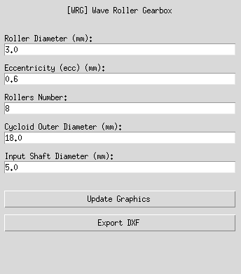
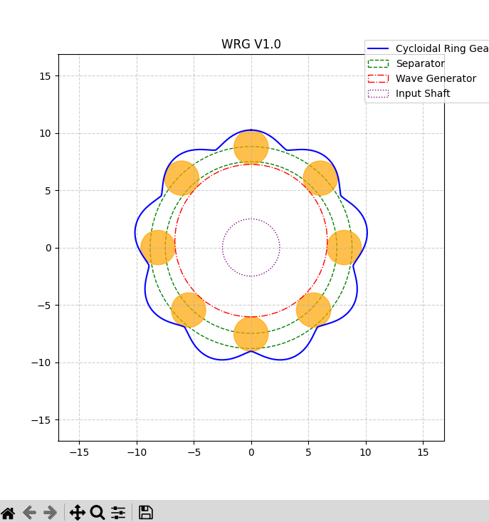

# WRG

_Wave Roller Gearbox_

## Quick Start
* Install `uv`

* Run the script on Linux :

```
./WRG.sh
```

* Run the script on MS Windows :

```
WRG.bat
```

 

## Ref
* This code is based on mshndev's code : https://gist.github.com/mshndev/1f52cd55a2f5263530c7625650091d6b
* https://github.com/pashamray/wave-roller-gear?tab=readme-ov-file
* Used Google Antigravity
